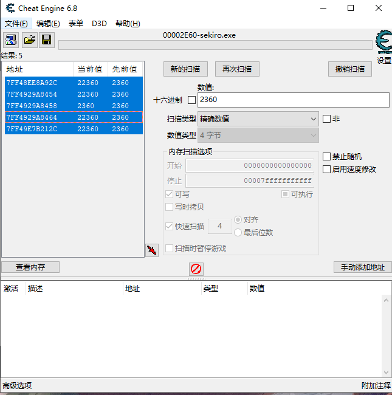

#  如何打造一款游戏外挂


###### 欢迎关注公众号，开启和我的交流


### 前言

记得小学的时候玩页游把家里电脑弄坏了(怎么回事，页游还能弄坏电脑?)，然后我爸拿去重新装了系统，回来之后电脑里有了两个新的单机游戏，植物大战僵尸和大鱼吃小鱼。

那个年代周围的小学生都是赛尔号/奥比岛/洛克王国/天书奇谭/龙之刃/梦幻西游，玩摩尔庄园的小学生说出来都不是九年义务教育的。植物大战僵尸虽然现在看来比较久远，但他的游戏元素却是推生出许多游戏音乐文化，比如Billie Eilish的《bad guy》，节奏简直就是植物大战僵尸的`灯 灯 灯 灯 灯灯~`了。

当时因为生存模式被虐，在网上找了修改器，可以修改阳光点数，那时候虽然没学计算机专业，但对修改器的运行机制还是有所猜测的，当时小学因为不知道内存这回事，所以是觉得修改的文件中的数据。

这个猜测如今看起来很搞笑，但也不失道理(要开始狡辩了)，有些游戏的数据可能是先放在文件中的，在游戏启动之后把文件中的数据读取到游戏的内存区域，所以我们需要先修改数据所在的文件内容，然后启动游戏，但是很多游戏的数据文件是加密的(出大问题，骑马与砍杀就没有加密)，我们没办法从文件进行修改，所以需要让游戏进程先把它读到内存，然后从内存修改，然后再退出游戏的时候游戏进程自动把它保存下来，之后也就是这个数据了。

所以综上可以发现有这几类修改对象：

1. 游戏数据在本地未加密文件，直接修改它来修改游戏数据

    * 这一类的代表就是骑马与砍杀，它的角色数据在文档中，可以肆意修改玩家属性，但是不要修改太大，因为数据会溢出。
此外它的游戏数据，如NPC对话，NPC姓名，国家名称，城堡名称都是明文给出的(还是用Excel保存的???)，最可怕的是它的内部机制，如兵种上限/士气/围攻时间/酒馆花费等都是明文的，怪不得骑砍会有各种版本。

2. 数据封装，通过修改内存来修改游戏数据

3. 网络游戏，数据在对方服务器，无法直接修改，通过模拟网络请求表单来模拟自己获得游戏物品(看对方服务器逻辑严密程度了)
    
    * 举几个例子(腾讯游戏全部忽略，这个不在新手教程里面)，你正在玩一个网页游戏龙之刃，打死了一个小怪，获得了15银币，这时你的网页需要给服务器发送给你银币数据+15的信息，你可以用浏览器自带的工具开发者调试看看这个数据的格式，然后模仿一个相似的，发送的服务器，比较菜的游戏厂商当然无法完善这方面的逻辑了。(另外我有一个想法，steam在我们玩游戏的时候应该会有一个线程监控我们正在玩什么游戏，所以我们可以监控这个线程发出的网络表单，然后我们自己不断发出，这不是卡套刷满？)

下面开始实战部分，因为不想再下载骑砍，而且这种修改文件的教程在骑砍官网很多，所以我就跳过啦。

### 一. 内存数据排查

游戏作为进程运行在我们的电脑中，所以要修改它的数据我们可以在内存进行搜索修改。

拿植物大战僵尸为例，我们要修改的是他的阳光数量。假如我们现在的阳光值是75，我们需要在内存中查找75的数字。


先用内存工具打开植物大战僵尸的进程。


然后查找25这个数字，下图只找到一个，所以阳光的数据就存储在21BF10C8这个地址了，但很多游戏搜索出来可能不止这一个地址，我们需要将查询的那个道具(阳光)花费掉一点，变成另一个值再次扫描一次才能精准定位。


修改这个地址的数值。


在游戏中查看阳光数量。


是不是太简单了?! 这是因为这个游戏本身设计已经和这个时代脱轨了，如今的游戏制造商不仅要考虑内容，还需要在安全上和高玩斗智斗勇。

接下来再拿一个游戏练练手，就是最近非常火的宫崎英高老贼作品只狼。

##### Sekiro : Shadows Die Twice

作为一个九周目下忍，这款游戏真的让我知道了死字怎么写。

先来看看我当前的金币，2323。


然后按照惯例选择只狼的进程，搜索2323这个数据，可以发现出现了很多。


我去杀了一个小怪，把金币加到了2360。 


再次搜索发现还有5个地址存在，直接修改会发现不会改变，有一种猜测是它用了一种类似于病毒中多进程相互守护一样的方法，会让数据保持一致，所以我们可以直接全部选中同事修改，会发现第三个没有修改成功，因为这个值不是背包中金币数量，而是战斗界面的数量，你可以自己试试。




金币顺利添加了两万，其它数据在本地的都是如此，可以自己尝试，但这种方法效率总是不高，我们可以使用代码的形式来把这个修改过程自动化。

这里多说一句，代码的方式是把数据的地址编码到代码中，如果游戏的更新导致这个地址改变话，代码里面也要同步修改，所以需要频繁更新的游戏其实修改器很多会失效。

### 二. 外挂程序编写

先来了解几个Windows的API。

    HWND FindWindow（LPCTSTR IpClassName，LPCTSTR IpWindowName）; 
    通过类名或窗口名查找，返回窗口句柄
    DWORD GetWindowThreadProcessId(HWND hWnd,LPDWORD lpdwProcessId); 
    得到窗口句柄后通过GetWindowThreadProcessId这个函数来获得窗口所属进程ID和线程ID
    HANDLE OpenProcess(DWORD dwDesiredAccess,BOOL bInheritHandle,DWORD dwProcessId) 
    打开一个已存在的进程对象，并返回进程的句柄
    bool WriteProcessMemory(HANDLE hProcess,LPVOID lpBaseAddress,LPVOID lpBuffer,DWORD nSize,LPDWORD lpNumberOfBytesWritten ); 
    能写入某一进程的内存区域。入口区必须可以访问，否则操作将失败

附上代码:

```c
#include <windows.h>
#include <stdio.h>
int main() {
	HWND h = ::FindWindow(NULL, "植物大战僵尸中文版");	//	寻找并打开进程
	DWORD processid;
	GetWindowThreadProcessId(h, &processid);
	HANDLE hprocess = 0;
	hprocess = OpenProcess(PROCESS_ALL_ACCESS, FALSE, processid);
	if (hprocess == 0) {	//	对应处理
		printf("打开进程失败!\n");
		return 1;
	} else {
		printf("打开进程成功!\n");
		DWORD hp = 3000;	//	要修改的游戏数据最大值	
		LPCVOID addr = (LPVOID)0x21BF10C8;	//	通过CE找到的游戏数据地址
		DWORD res = WriteProcessMemory(hprocess, (LPVOID)addr, &hp, 4, 0);	//	写入内存修改游戏数据
		return 0;
	}
}
```


这样一个代码，可以让我们随时调用，把阳光修改为2000，这个程序没有做图形化界面，因为太简单了，所以当做入门Demo吧。

我们修改了通过地址直接游戏的数据，那么能不能说做一个游戏助手，读出游戏的某些数据来辅助玩家呢？ CE工具虽然可以搜索读取，但是效率太差，接下来介绍一个新的API，来读取固定地址的数据。

    HWND ReadProcessMemory(HANDLE hProcess, LPCVOID lpBaseAddress, LPVOID lpBuffer, DWORD nSize, LPDWORD lpNumberOfBytesRead); 
    根据进程句柄读入该进程的某个内存空间lpBaseAddress的nSize字节，并写入缓冲区lpBuffer，多次计算基址和偏移即可 

尝试读取 ：


附上代码实现：
```c
#include <stdio.h>
#include <windows.h>
int main() {
	HWND h = ::FindWindow(NULL, "植物大战僵尸中文版");   //	  寻找并打开进程
	DWORD processid;
	GetWindowThreadProcessId(h, &processid);
	HANDLE processh = 0;
	processh = OpenProcess(PROCESS_ALL_ACCESS,FALSE,processid);

	if (processh == 0) { 	//    对应处理
        printf("打开进程失败!\n");
        return 1;
	} else {
		printf("打开进程成功!\n");
		int sun;    //	  用于存放阳光数据
		LPCVOID mbase = (LPCVOID)0x1E0CF020;
		LPVOID mbuffer = (LPVOID)&sun;
		::ReadProcessMemory(processh, mbase, mbuffer, 4,  0);
		printf("您有阳光:%d\n", sun);
	return 0;
}
```

### 三. 挂机自动外挂

上述都是一些修改数据的外挂，此外还有一种是自动操作类的修改器，比如自动玩连连看(雾)，自动下棋(雾)，自动拼图(笑)。

例如下面这样的连连看，当你用CE观察内存时，会发现它的数据奇妙在于这是一个二维数组，在内存中不同牌有不同数值。


想要自动消除连连看，肯定需要先模拟鼠标的操作，介绍一个API，它可以模拟鼠标操作，但不会移动我们的物理鼠标(虚无点击？)。

    LRESULT SendMessage（HWND hWnd，UINT Msg，WPARAM wParam，LPARAM IParam）;
    其中Msg为WM_LBUTTONDOWN，WM_LBUTTONUP，表示对鼠标的软件模拟操作(虽然兼容性和安全性不如硬件模拟的mouse_event，但不改变移动鼠标指针)
    
除此之外，对一个二维数组寻找可以消除的两幅牌，可以使用BFS算法实现。

```c
void clearapair() {	//找到可消去的两个点并点击
	 POINT p1, p2;
	 int x1, y1, x2, y2;
	  for (y1=0; y1<11; y1++)
		  for (x1=0; x1<19; x1++) {
		  	 if (!chessdata[y1][x1])
		 	  	continue;
			  for (y2=0; y2<11; y2++)
				for (x2=0; x2<19; x2++)
				  if (chessdata[y2][x2] && (chessdata[y1][x1]==chessdata[y2][x2]) && (x1!=x2 || y1!=y2) )  {  
					  p1.x=x1; p1.y=y1;
					  p2.x=x2; p2.y=y2;
					  readchess();
					  if (llk_bfs(y1, x1, y2, x2) != -1) {
					  	click2p(p1, p2);
					  	return;	
					  }
				  }
		  }
}
```

### 四. 网络游戏修改

这个是我从小学四年级开始玩的游戏，因为时间很长没有登录，这里累积了很多经验，在领取之前我们可以先观察一下。


抓到了一条表单。


初步分析，经验数据不是直接明文规定的，而是从了其他数值代替，并且获取经验这一类型也是有其他数字代替，这里初步猜测为age。


好吧，可能种类太多，抓不出来相同的Age。

但是我换了一种方式，对宠物使用了两次经验包，抓下来的两次包，都是叫fcode1f3....的这个包。

其中Age类型也是一样。


现在过了几分钟，我们把第三个包也使用掉。


囊达？ 难道，这个Age真的是...(小声bb) 

还是不确定，让我们用爬虫来模拟这次表单吧，刷爆(封号)!!!

测试N次过后...


成功啦!!!

需要注意的是，这个游戏服务器以及几年没更新了，上一条公告还是十年前的。

如果你要使用爬虫来模拟使用道具，非常关键的一个信息就是cookie，这是确认你登录的账号的判断信息。

下面贴出代码(我的cookie肯定要删除掉啦)

```java
import java.util.ArrayList;
import java.util.List;
import org.apache.http.Header;
import org.apache.http.HttpResponse;
import org.apache.http.NameValuePair;
import org.apache.http.client.ResponseHandler;
import org.apache.http.client.entity.UrlEncodedFormEntity;
import org.apache.http.client.methods.HttpGet;
import org.apache.http.client.methods.HttpPost;
import org.apache.http.impl.client.BasicResponseHandler;
import org.apache.http.impl.client.CloseableHttpClient;
import org.apache.http.impl.client.HttpClients;
import org.apache.http.message.BasicNameValuePair;
import org.apache.http.protocol.HTTP;

public class Renren {
    private static String renRenLoginURL = "http://resourcemop.l.imop.com/res/fc/fcde1f39034b164a0d5fe7e455b0c32e";
    private HttpResponse response;
    private CloseableHttpClient httpclient = HttpClients.createDefault();
    private boolean login() {
        HttpGet httpGet = new HttpGet(renRenLoginURL);
        httpGet.setHeader("Accept-Ranges", "bytes");
        httpGet.setHeader("Age", "74342");
        httpGet.setHeader("Cache-Control", "");
        httpGet.setHeader("Content-Length", "3266");
        httpGet.setHeader("Content-Type", "text/plain");
        httpGet.setHeader("Date", "Thu, 23 May 2019 08:41:58 GMT");
        httpGet.setHeader("Expires", "Sun, 20 May 2029 08:41:58 GMT");
        httpGet.setHeader("Last-Modified", "Wed, 22 May 2019 08:13:20 GMT");
        httpGet.setHeader("Server", "Apache");
        httpGet.setHeader("Via", "1.0 Static1.lzr.squid1:80 (squid/2.6.STABLE7)");
        httpGet.setHeader("X-Cache", "HIT from Static1.lzr.squid1");
        httpGet.setHeader("Referer", "http://s34.l.imop.com/");
        httpGet.setHeader("User-Agent", "Mozilla/5.0 (Windows NT 10.0; Win64; x64) AppleWebKit/537.36 (KHTML, like Gecko) Chrome/75.0.3770.100 Safari/537.36");
        try {
            response = httpclient.execute(httpGet);
        } catch (Exception e) {
            e.printStackTrace();
            return false;
        } finally {
            httpGet.abort();
        }
        return true;
    }

    public static void main(String[] args) {
        Renren renRen = new Renren();
        renRen.login();
    }
}
```

这个其实是两年前写的人人网爬虫，改了改表单数据就可以用啦。

篇幅有限，所以暂时就写这么多。之后可能会继续更新其他的修改教程，steam挂卡这个我是一定要写的。

敲代码是热爱，敲到世界充满爱！ 撤退！
